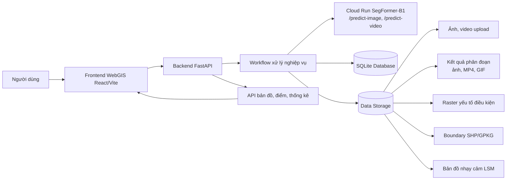
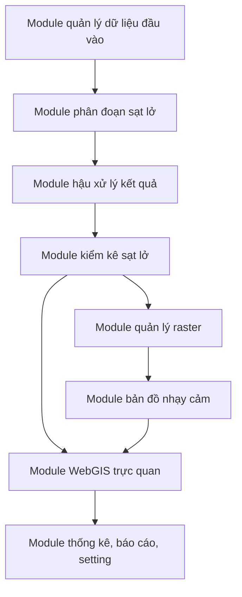
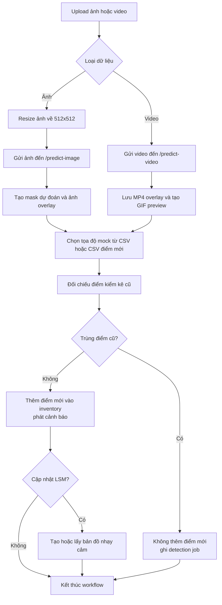

# Kiến trúc hệ thống WebGIS

## 1. Mục tiêu hệ thống

Hệ thống WebGIS được xây dựng nhằm liên kết toàn bộ quy trình từ tiếp nhận ảnh/video đầu vào, phát hiện vùng sạt lở bằng mô hình học sâu, cập nhật cơ sở dữ liệu kiểm kê sạt lở, đến trực quan hóa bản đồ nhạy cảm sạt lở trên nền bản đồ tương tác.

Hệ thống không chỉ đóng vai trò hiển thị bản đồ, mà còn là nền tảng quản lý dữ liệu không gian, lưu trữ kết quả nhận dạng, theo dõi điểm sạt lở mới và hỗ trợ cập nhật bản đồ nhạy cảm sạt lở khi có dữ liệu phát hiện mới.

## 2. Kiến trúc tổng thể

Kiến trúc hệ thống được tổ chức theo mô hình nhiều lớp, gồm lớp giao diện WebGIS, lớp API nghiệp vụ, lớp xử lý ảnh/mô hình, lớp dữ liệu không gian và lớp lưu trữ.



## 3. Các thành phần chính

### 3.1. Frontend WebGIS

Frontend mới được xây dựng bằng React/Vite trong thư mục `frontend-react`. Giao diện được tổ chức theo các tab chức năng chính:

- **Tổng thể**: hiển thị workflow từ phát hiện sạt lở đến cập nhật CSDL và bản đồ nhạy cảm.
- **Phân đoạn sạt lở**: upload ảnh/video, chọn ảnh test, chạy mô hình phân đoạn và xem output.
- **CSDL sạt lở**: xem bảng kiểm kê, lọc dữ liệu, thống kê theo huyện và quy mô.
- **Bản đồ nhạy cảm**: hiển thị bản đồ LSM thật từ GeoTIFF/PNG preview.
- **Setting**: cấu hình chế độ tạo điểm trùng/điểm mới và nguồn bản đồ vệ tinh.

Frontend sử dụng Leaflet để hiển thị bản đồ nền vệ tinh, lớp boundary vùng nghiên cứu, ranh giới huyện, điểm kiểm kê sạt lở và lớp overlay bản đồ nhạy cảm.

### 3.2. Backend API

Backend được xây dựng bằng FastAPI trong thư mục `backend`. Thành phần này tiếp nhận request từ frontend, điều phối workflow xử lý, gọi mô hình phân đoạn từ Cloud Run, lưu kết quả vào SQLite và cung cấp dữ liệu cho WebGIS.

Các file backend chính:

- `backend/main.py`: khai báo FastAPI app và các endpoint.
- `backend/workflow.py`: xử lý workflow nghiệp vụ phát hiện, lưu kết quả, cập nhật CSDL, tạo report và bản đồ nhạy cảm.
- `backend/models.py`: tiền xử lý ảnh, gọi API mô hình, tạo overlay ảnh/video/GIF.
- `backend/database.py`: khởi tạo SQLite, seed dữ liệu CSV, đọc/ghi dữ liệu kiểm kê.
- `backend/boundary.py`: đọc boundary vùng nghiên cứu.
- `backend/districts.py`: đọc boundary huyện và gán huyện cho điểm mới.
- `backend/config.py`: cấu hình đường dẫn dữ liệu, endpoint mô hình, pixel size và tham số workflow.

### 3.3. Mô hình phân đoạn sạt lở

Mô hình phân đoạn sử dụng SegFormer-B1, được triển khai bên ngoài qua Cloud Run:

- `/predict-image`: nhận ảnh đầu vào đã resize 512x512 và trả kết quả phân đoạn ảnh.
- `/predict-video`: nhận video đầu vào và trả video overlay vùng sạt lở màu đỏ.

Backend đóng vai trò trung gian:

1. Lưu file upload.
2. Tiền xử lý ảnh về kích thước 512x512.
3. Gửi ảnh/video đến endpoint mô hình.
4. Nhận mask hoặc video overlay.
5. Tạo ảnh kết quả, video output và GIF preview.
6. Ghi nhận metadata vào database.

### 3.4. Cơ sở dữ liệu kiểm kê sạt lở

Hệ thống sử dụng SQLite để chạy demo nhanh, có thể nâng cấp sang PostgreSQL/PostGIS khi triển khai thật.

Các nhóm dữ liệu chính:

- `inventory`: điểm kiểm kê sạt lở cũ và điểm mới từ AI.
- `detection_jobs`: lịch sử các lần phát hiện ảnh/video.
- `raster_layers`: danh sách raster yếu tố điều kiện.
- `susceptibility_maps`: thông tin bản đồ nhạy cảm sạt lở.
- `app_settings`: setting giao diện và workflow.

Dữ liệu kiểm kê ban đầu được seed từ file CSV có cấu trúc:

```text
lon,lat,huyen,xa,thon,dien_tich,quy_mo,mo_ta
```

Khi phát hiện điểm mới, backend tự tạo trường thời gian ghi nhận `observed_at`, gán nguồn dữ liệu `ai_detected` hoặc `ai_detected_video`, sau đó lưu vào bảng `inventory`.

### 3.5. Dữ liệu không gian và raster

Dữ liệu không gian được lưu trong thư mục `data`, gồm:

```text
data/boundary
data/boundary/huyen
data/raster/do_cao
data/raster/do_doc
data/raster/huong_suon
data/raster/luong_mua
data/raster/thach_hoc
data/raster/lop_phu
data/raster/khoang_cach_duong
data/raster/khoang_cach_song
data/susceptibility
```

Boundary vùng nghiên cứu được đọc từ shapefile. Boundary cấp huyện được đọc từ GeoPackage để hỗ trợ gán đúng tên huyện cho điểm mới phát hiện.

Các raster yếu tố điều kiện được dùng cho bài toán nhạy cảm sạt lở, bao gồm độ cao, độ dốc, hướng sườn, lượng mưa, thạch học, lớp phủ đất, khoảng cách đến đường giao thông và khoảng cách đến sông suối.

### 3.6. Thiết kế các module chức năng

Hệ thống được thiết kế theo các module chức năng độc lập tương đối, mỗi module đảm nhiệm một nhóm nghiệp vụ cụ thể nhưng vẫn liên kết với nhau thông qua backend API và cơ sở dữ liệu trung tâm. Cách tổ chức này giúp workflow phát hiện sạt lở có thể chạy tuần tự từ dữ liệu đầu vào đến trực quan hóa kết quả trên WebGIS.



#### 3.6.1. Module quản lý dữ liệu đầu vào

Module này cho phép người dùng đưa dữ liệu ảnh, ảnh test hoặc video vào hệ thống để phục vụ phát hiện sạt lở.

Chức năng chính:

- upload ảnh viễn thám, ảnh UAV hoặc video;
- lưu file đầu vào vào thư mục `data/uploads`;
- phân loại dữ liệu đầu vào theo ảnh hoặc video;
- đối với ảnh, chuyển dữ liệu sang bước tiền xử lý 512x512;
- đối với video, chuyển dữ liệu sang endpoint `/predict-video`;
- quản lý danh sách ảnh test trong `data/segment/img` và mask tương ứng trong `data/segment/mask`.

Đầu vào của module:

- file ảnh: `.jpg`, `.jpeg`, `.png`, `.tif`, `.tiff`, `.bmp`;
- file video: `.mp4`, `.avi`, `.mov`, `.mkv`, `.webm`;
- ảnh test có sẵn trong thư mục dữ liệu.

Đầu ra của module:

- đường dẫn file đã lưu;
- loại dữ liệu đầu vào;
- metadata cơ bản như tên file, kích thước và nguồn dữ liệu.

#### 3.6.2. Module phân đoạn sạt lở

Module phân đoạn là thành phần xử lý AI chính của hệ thống. Module này kết nối backend với mô hình SegFormer-B1 được triển khai thông qua Cloud Run.

Chức năng chính:

- resize ảnh đầu vào về kích thước 512x512;
- gửi ảnh đến endpoint `/predict-image`;
- gửi video đến endpoint `/predict-video`;
- nhận kết quả mask, xác suất, diện tích pixel và thông tin thống kê từ mô hình;
- hỗ trợ chế độ ảnh upload, ảnh test và video upload;
- ghi nhận trạng thái dự đoán như `remote_ok`, `mock_remote_failed` hoặc lỗi endpoint.

Đầu vào của module:

- ảnh đã tiền xử lý 512x512;
- video upload;
- tham số mô hình như threshold và frame stride.

Đầu ra của module:

- mask phân đoạn vùng sạt lở;
- ảnh overlay kết quả;
- video overlay;
- thống kê suy luận gồm số frame, xác suất lớn nhất, diện tích pixel và thời gian xử lý.

#### 3.6.3. Module hậu xử lý kết quả phân đoạn

Module hậu xử lý chuyển kết quả thô từ mô hình thành dữ liệu dễ hiển thị và dễ lưu trữ hơn.

Chức năng chính:

- tạo ảnh overlay vùng sạt lở màu đỏ;
- với ảnh test, overlay nhãn thật màu xanh lá và mask dự đoán màu đỏ;
- lưu ảnh kết quả vào `data/output/image`;
- lưu video overlay vào `data/output/video`;
- tạo GIF preview từ video để frontend hiển thị ổn định hơn;
- chuẩn hóa các đường dẫn output thành URL `/media/...` để frontend truy cập.

Đầu ra của module:

- `preprocessed_image_url`;
- `output_image_url`;
- `true_mask_url`;
- `output_video_url`;
- `output_gif_url`.

#### 3.6.4. Module kiểm kê sạt lở

Module kiểm kê là thành phần trung gian giữa kết quả nhận dạng và phân tích không gian. Module này quyết định kết quả phát hiện có được thêm vào cơ sở dữ liệu hay không.

Chức năng chính:

- đọc dữ liệu kiểm kê cũ từ CSV và seed vào SQLite;
- chọn tọa độ mock từ CSV điểm cũ hoặc CSV điểm mới;
- dùng boundary huyện để gán đúng tên huyện cho điểm mới;
- đối chiếu điểm phát hiện với các điểm kiểm kê đã có;
- xác định kết quả là điểm trùng hay điểm mới;
- lưu điểm mới vào bảng `inventory`;
- lưu lịch sử phát hiện vào bảng `detection_jobs`;
- phát cảnh báo khi có điểm sạt lở mới.

Logic quyết định:

```text
nếu khoảng cách đến điểm cũ <= ngưỡng trùng
    -> xem là kết quả trùng, không thêm inventory mới
ngược lại
    -> xem là điểm mới, thêm vào inventory và cảnh báo
```

Các thông tin lưu cho mỗi điểm:

- tọa độ `lon`, `lat`;
- huyện, xã, thôn;
- diện tích;
- quy mô;
- mô tả;
- nguồn dữ liệu;
- thời gian ghi nhận;
- trạng thái điểm mới hoặc điểm cũ.

#### 3.6.5. Module quản lý raster yếu tố điều kiện

Module này quản lý các lớp raster phục vụ phân tích nhạy cảm sạt lở.

Chức năng chính:

- lưu trữ các raster yếu tố điều kiện trong `data/raster`;
- tự động đăng ký raster có sẵn vào bảng `raster_layers`;
- phân nhóm raster theo loại yếu tố;
- cung cấp danh sách raster cho frontend;
- làm đầu vào cho bước trích xuất đặc trưng và lập bản đồ nhạy cảm.

Các nhóm raster chính:

- độ cao;
- độ dốc;
- hướng sườn;
- lượng mưa;
- thạch học;
- lớp phủ đất;
- khoảng cách đến đường giao thông;
- khoảng cách đến sông suối.

#### 3.6.6. Module bản đồ nhạy cảm sạt lở

Module này quản lý việc hiển thị và cập nhật bản đồ nhạy cảm sạt lở.

Chức năng chính:

- đọc bản đồ nhạy cảm có sẵn từ `data/susceptibility`;
- chuyển GeoTIFF thành PNG preview để hiển thị trên Leaflet;
- đọc bounding box của raster để đặt overlay đúng vị trí;
- lưu thông tin bản đồ vào bảng `susceptibility_maps`;
- cung cấp API lấy bản đồ nhạy cảm mới nhất;
- tạo bản đồ nhạy cảm demo nếu chưa có file thật.

Đầu ra của module:

- `overlay_url`;
- `bbox`;
- tiêu đề bản đồ;
- trạng thái xử lý;
- thông báo mô tả nguồn bản đồ.

#### 3.6.7. Module trực quan hóa WebGIS

Module WebGIS chịu trách nhiệm hiển thị dữ liệu không gian và kết quả phân tích trên bản đồ tương tác.

Chức năng chính:

- hiển thị nền vệ tinh Esri hoặc Google tile;
- hiển thị boundary vùng nghiên cứu;
- hiển thị ranh giới huyện;
- hiển thị điểm kiểm kê cũ và điểm AI mới;
- hiển thị bản đồ nhạy cảm dưới dạng raster overlay;
- cho phép bật/tắt lớp dữ liệu;
- cho phép zoom, pan và xem popup thuộc tính điểm;
- hỗ trợ nút **Xem vị trí** để zoom đến điểm mới sau khi người dùng đã xem output phân đoạn.

Các tab sử dụng bản đồ:

- tab **Tổng thể**;
- tab **Bản đồ nhạy cảm**.

#### 3.6.8. Module thống kê, báo cáo và cấu hình

Module này hỗ trợ người dùng theo dõi tình trạng dữ liệu và cấu hình workflow chạy thử.

Chức năng thống kê:

- tổng số điểm kiểm kê;
- số điểm mới từ AI;
- số lần phát hiện;
- số lần trùng điểm cũ;
- tổng diện tích ước tính;
- thống kê theo huyện;
- thống kê theo quy mô.

Chức năng báo cáo:

- tạo báo cáo dạng text trong `data/reports`;
- tổng hợp số liệu kiểm kê;
- liệt kê các điểm gần đây;
- hỗ trợ xuất dữ liệu phục vụ báo cáo đồ án hoặc kiểm chứng.

Chức năng cấu hình:

- bật/tắt chế độ tạo kết quả trùng điểm cũ;
- chọn nguồn bản đồ vệ tinh;
- cấu hình custom tile URL;
- đọc các tham số backend như endpoint mô hình, pixel size và ngưỡng trùng.

#### 3.6.9. Quan hệ giữa các module

Các module không hoạt động tách rời, mà được kết nối thành một chuỗi xử lý thống nhất:

```text
Quản lý dữ liệu đầu vào
-> Phân đoạn sạt lở
-> Hậu xử lý kết quả
-> Kiểm kê sạt lở
-> Quản lý raster và bản đồ nhạy cảm
-> Trực quan hóa WebGIS
-> Thống kê, báo cáo và cấu hình
```

Trong đó, backend API đóng vai trò điều phối, database đóng vai trò lưu trạng thái và frontend WebGIS đóng vai trò giao diện thao tác, kiểm tra và trực quan hóa kết quả.

## 4. Workflow xử lý chính

Workflow chính của hệ thống gồm các bước sau:



## 5. Luồng phát hiện ảnh

Đối với ảnh upload hoặc ảnh test trong `data/segment`, hệ thống xử lý như sau:

1. Người dùng chọn ảnh và bấm predict.
2. Backend lưu ảnh vào `data/uploads/image`.
3. Ảnh được resize về 512x512.
4. Backend gọi endpoint `/predict-image`.
5. Kết quả mask được overlay lên ảnh gốc.
6. Nếu là ảnh test, hệ thống hiển thị thêm nhãn thật màu xanh lá.
7. Kết quả dự đoán được hiển thị màu đỏ.
8. Hệ thống đối chiếu vị trí mock với CSDL kiểm kê.
9. Nếu là điểm mới, bản ghi được thêm vào SQLite và hiển thị cảnh báo.

Layout output:

- Predict ảnh upload: ảnh đầu vào và ảnh phân đoạn.
- Predict ảnh test: ảnh đầu vào, nhãn thật và ảnh phân đoạn.

## 6. Luồng phát hiện video

Đối với video, backend gửi video đến endpoint `/predict-video`. Endpoint trả về kết quả thống kê và video overlay vùng sạt lở.

Backend xử lý tiếp:

1. Lưu MP4 overlay vào `data/output/video`.
2. Tạo thêm GIF preview để frontend hiển thị ổn định hơn.
3. Ghi metadata vào bảng `detection_jobs`.
4. Tính diện tích sạt lở ước tính từ số pixel và kích thước pixel 4.7 m/pixel.
5. Đối chiếu điểm cũ và thêm điểm mới nếu không trùng.

Frontend hiển thị:

- MP4 output nếu trình duyệt phát được.
- GIF preview làm fallback.
- Thống kê số frame, stride, xác suất lớn nhất và thời gian suy luận.

## 7. Quản lý điểm mới và cảnh báo

Khi có kết quả phát hiện, hệ thống không tự động coi mọi kết quả là điểm mới. Backend thực hiện đối chiếu với CSDL kiểm kê theo khoảng cách:

- Nếu bật chế độ tạo điểm trùng: hệ thống chọn vị trí gần điểm cũ để test logic trùng.
- Nếu tắt chế độ tạo điểm trùng: hệ thống lấy vị trí từ CSV điểm mới hoặc dịch tọa độ ra xa vài km để mô phỏng phát hiện mới.

Nếu điểm mới không trùng với điểm cũ, hệ thống:

- thêm bản ghi vào bảng `inventory`;
- gán `is_new = 1`;
- tạo thông báo cảnh báo;
- cho phép người dùng bấm **Xem vị trí** để zoom đến điểm mới trên bản đồ.

## 8. Bản đồ WebGIS

Bản đồ WebGIS được hiển thị ở hai tab chính:

- **Tổng thể**: hiển thị điểm kiểm kê, điểm mới, boundary và huyện.
- **Bản đồ nhạy cảm**: hiển thị bản đồ LSM overlay cùng các lớp nền.

Các lớp bản đồ gồm:

- nền vệ tinh Esri hoặc Google tile;
- boundary vùng nghiên cứu;
- ranh giới huyện;
- điểm sạt lở cũ;
- điểm sạt lở mới;
- bản đồ nhạy cảm sạt lở.

Người dùng có thể zoom, pan, bật/tắt lớp và click vào điểm để xem thông tin thuộc tính như huyện, xã, thôn, diện tích, quy mô và ngày ghi nhận.

## 9. Bản đồ nhạy cảm sạt lở

Hệ thống ưu tiên hiển thị bản đồ nhạy cảm thật nếu tìm thấy GeoTIFF trong thư mục `data/susceptibility`.

Quy trình:

1. Backend phát hiện file `.tif` hoặc `.tiff`.
2. Tạo PNG preview từ GeoTIFF.
3. Đọc bounding box không gian.
4. Lưu thông tin vào bảng `susceptibility_maps`.
5. Frontend hiển thị PNG preview bằng `Leaflet.imageOverlay`.

Nếu chưa có bản đồ thật, backend có thể tạo bản đồ demo từ các điểm kiểm kê để phục vụ kiểm thử giao diện.

## 10. API chính

Các endpoint chính của hệ thống:

| Phương thức | Endpoint | Chức năng |
|---|---|---|
| `GET` | `/health` | Kiểm tra trạng thái backend |
| `GET` | `/api/settings` | Đọc cấu hình hệ thống |
| `POST` | `/api/settings` | Lưu cấu hình workflow và tile map |
| `POST` | `/api/workflows/detect` | Predict ảnh hoặc video upload |
| `POST` | `/api/workflows/detect-segment-sample` | Predict ảnh test trong `data/segment` |
| `GET` | `/api/segment-samples` | Danh sách ảnh test và mask |
| `GET` | `/api/points` | Danh sách điểm kiểm kê |
| `GET` | `/api/stats` | Thống kê kiểm kê và phát hiện |
| `GET` | `/api/boundary` | Boundary vùng nghiên cứu |
| `GET` | `/api/boundary/huyen` | Boundary cấp huyện |
| `GET` | `/api/rasters` | Danh sách raster yếu tố điều kiện |
| `GET` | `/api/susceptibility/maps/latest` | Bản đồ nhạy cảm mới nhất |
| `POST` | `/api/susceptibility/maps` | Tạo/cập nhật bản đồ nhạy cảm |
| `POST` | `/api/reports` | Tạo báo cáo thống kê |

## 11. Cấu trúc thư mục

```text
E:\DATN
├── backend
│   ├── main.py
│   ├── workflow.py
│   ├── models.py
│   ├── database.py
│   ├── boundary.py
│   ├── districts.py
│   └── config.py
├── frontend-react
│   ├── src
│   │   ├── App.jsx
│   │   ├── api
│   │   ├── components
│   │   ├── pages
│   │   └── styles
│   └── package.json
├── frontend
│   ├── index.html
│   ├── app.js
│   └── style.css
├── data
│   ├── uploads
│   ├── output
│   ├── boundary
│   ├── raster
│   ├── segment
│   ├── susceptibility
│   ├── reports
│   └── webgis.sqlite3
└── README.md
```

## 12. Khả năng mở rộng

Phiên bản hiện tại ưu tiên chạy được workflow chính để kiểm thử nhanh. Khi triển khai thực tế, hệ thống có thể mở rộng theo các hướng:

- thay SQLite bằng PostgreSQL/PostGIS;
- lưu raster lớn bằng GeoServer, Cloud Optimized GeoTIFF hoặc tile server;
- tách hàng đợi xử lý video bằng Celery/RQ;
- lưu file upload/output trên object storage;
- bổ sung xác thực người dùng và phân quyền;
- bổ sung trạng thái kiểm chứng thực địa cho điểm mới;
- tích hợp mô hình ExtraTrees/XGBoost để tạo LSM động từ raster stack;
- thêm versioning cho bản đồ nhạy cảm theo thời gian.

## 13. Tóm tắt

Kiến trúc WebGIS được thiết kế như một pipeline khép kín:

```text
Ảnh/video đầu vào
-> phân đoạn sạt lở bằng SegFormer-B1
-> hậu xử lý ảnh/video output
-> đối chiếu điểm kiểm kê cũ
-> thêm điểm mới và cảnh báo nếu cần
-> cập nhật CSDL SQLite
-> hiển thị WebGIS và bản đồ nhạy cảm sạt lở
```

Cách tổ chức này giúp liên kết chặt chẽ giữa nhận dạng ảnh viễn thám, quản lý dữ liệu không gian, kiểm kê sạt lở và trực quan hóa bản đồ nhạy cảm trong một hệ thống WebGIS thống nhất.
